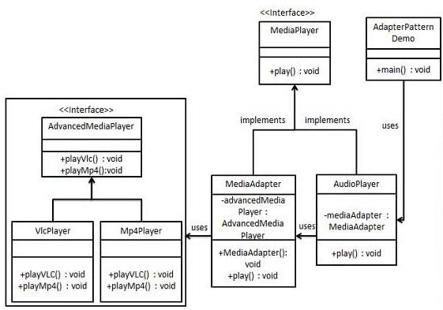
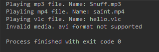

# Adapter Pattern

类型：结构型模式。

作为两个不兼容的接口之间的桥梁，将一个类的接口转换成希望的另外一个接口，使得原本由于接口不兼容而不能一起工作的类可以一起工作。

关键代码： 适配器继承或者依赖已有的对象，实现想要的目标接口

应用实例： JDBC， 不同国家电器电压转换适配器。

### 优点
>1.可以让两个没有关联的类一起运行  
>2.提高了类的复用  
>3.增加了类的透明度  
>4.灵活性好

### 缺点
>1.过多使用适配器，会让系统非常凌乱  
>2.Java至多继承一个类，所以之多只能适配一个适配者类，而且目标必须是抽象类

### 注意事项
适配器不是在详细设计时添加的，而是解决正在服役的项目的问题。

#### 实例类图

#### 运行结果

