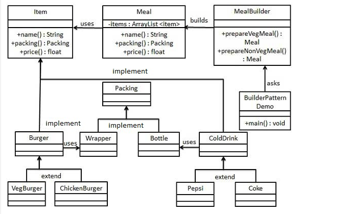
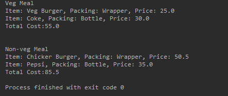

# 建造者模式
分类：创建型模式

使用多个简单对象一步一步构建成一个复杂对象。

使用场景：基本部件不会变，而组合经常变化的时候。

应用实例：餐厅点菜，套餐。

## 优点
1.建造者独立，易扩展

2.便于控制细节风险

## 缺点
1.产品必须要有共同点，范围有限制。

2.如果内部变化复杂，会有很多建造类。

## 实例
汉堡和可乐套餐，打包方式，组合。

类图如下：

运行结果：

